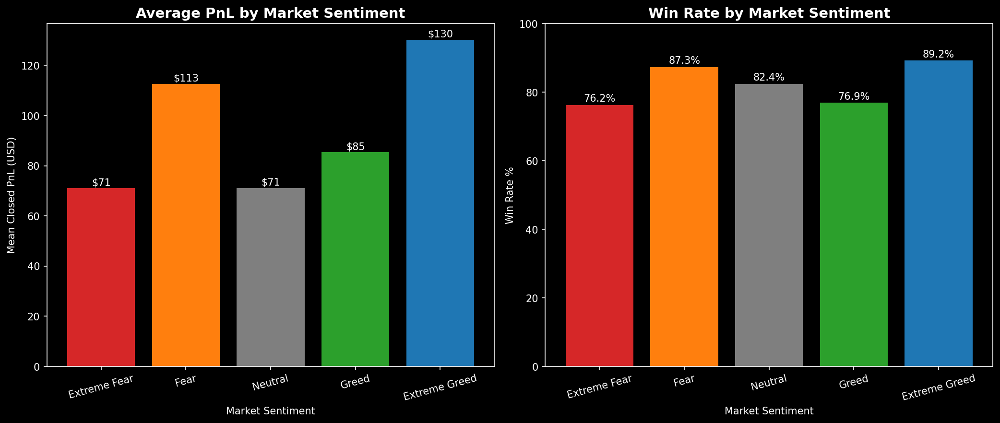
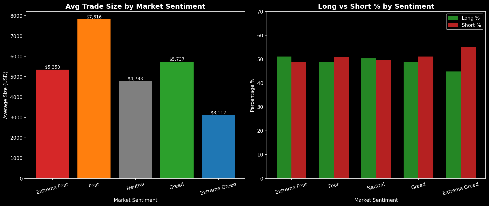
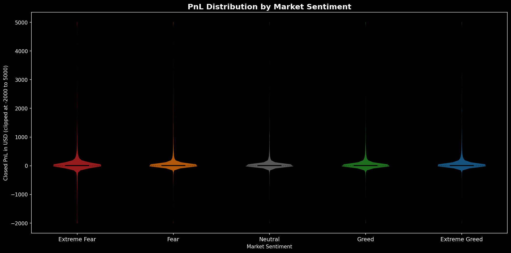
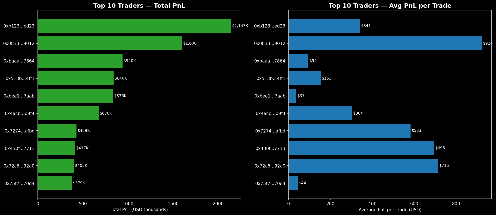
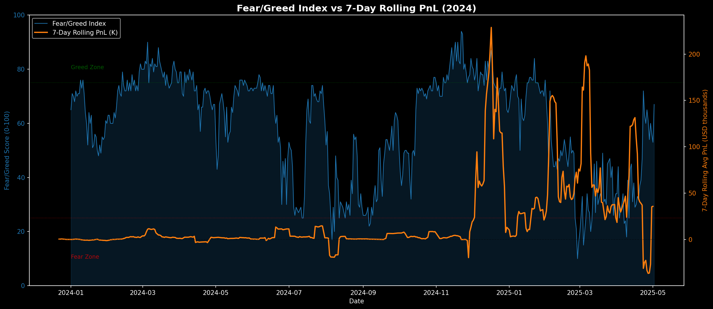
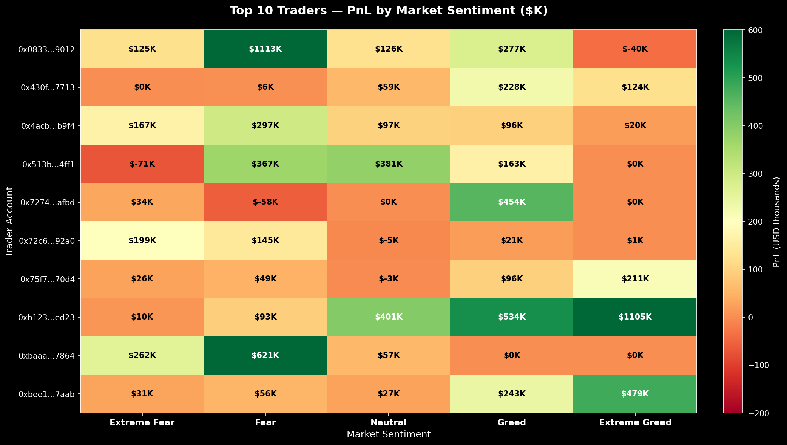
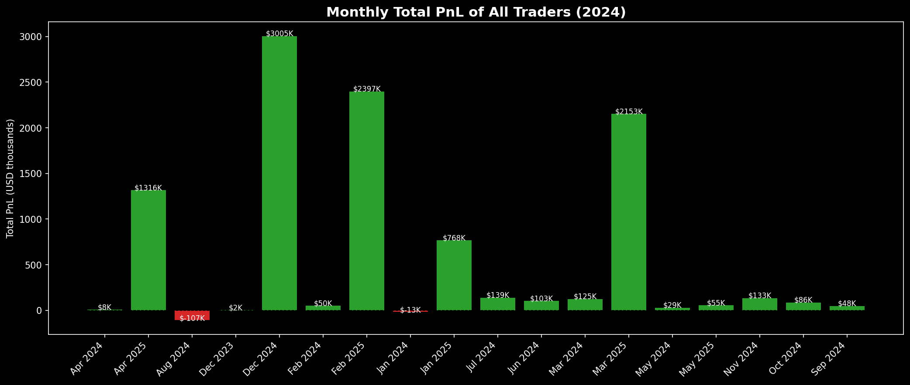

# Bitcoin Market Sentiment × Trader Performance Analysis

## Overview
This project explores the relationship between the Bitcoin 
Fear & Greed Index and trader performance on Hyperliquid, 
uncovering hidden behavioral patterns to drive smarter 
trading strategies.

## Datasets
- **Fear & Greed Index** — 2,644 daily sentiment readings (2018–2025)
- **Hyperliquid Trades** — 211,224 trades across 32 traders (Jan–Dec 2024)

 ### Fear & Greed Index Scale
| Score | Classification |
|-------|---------------|
| 0–24 | Extreme Fear |
| 25–44 | Fear |
| 45–55 | Neutral |
| 56–75 | Greed |
| 76–100 | Extreme Greed |

## Key Findings
1. **Extreme Greed = Best conditions** — 89.2% win rate & $130 avg PnL
2. **Fear = Largest positions** — traders deploy $7,816 avg during fear
3. **Contrarian behavior** — 55% SHORT trades during Extreme Greed
4. **Bull run spike** — PnL exploded 10x during Nov-Dec 2024
5. **Top trader** — $2.14M profit across 6,279 trades

## Charts & Visualizations

### 1. Average PnL & Win Rate by Sentiment


### 2. Trade Size & Long/Short Behavior by Sentiment


### 3. PnL Distribution by Sentiment


### 4. Top 10 Traders Ranked


### 5. Fear/Greed Index vs 7-Day Rolling PnL (2024)


### 6. Top Traders × Sentiment Heatmap


### 7. Monthly Total PnL (2024)



## Results Summary

| Sentiment | Mean PnL | Win Rate | Avg Trade Size | Long % |
|-----------|----------|----------|----------------|--------|
| Extreme Fear | $71 | 76.2% | $5,350 | 51.1% |
| Fear | $113 | 87.3% | $7,816 | 49.0% |
| Neutral | $71 | 82.4% | $4,783 | 50.3% |
| Greed | $85 | 76.9% | $5,737 | 48.9% |
| Extreme Greed | $130 | 89.2% | $3,112 | 44.9% |

## Trading Strategy Recommendations

| Sentiment | Recommended Action | Reason |
|-----------|-------------------|--------|
| Extreme Fear | Go LONG, small size | Low win rate, wait for confirmation |
| Fear | Go LONG, large size | Highest trade volume, strong returns |
| Neutral | Reduce exposure | Lowest PnL, choppy market |
| Greed | Start taking profits | Win rate begins to drop |
| Extreme Greed | Consider SHORT | 55% of top traders go short here |


## Tools Used
Python 3.14 | pandas | numpy | matplotlib | seaborn | scipy

## How to Run

```bash
# Clone the repository
git clone https://github.com/Xercsus/bitcoin-sentiment-analysis.git

# Navigate to project folder
cd bitcoin-sentiment-analysis

# Install dependencies
pip install -r requirements.txt

# Open the notebook
jupyter notebook bitcoin_analysis.ipynb
```
## Author
**Krish Kiran**
